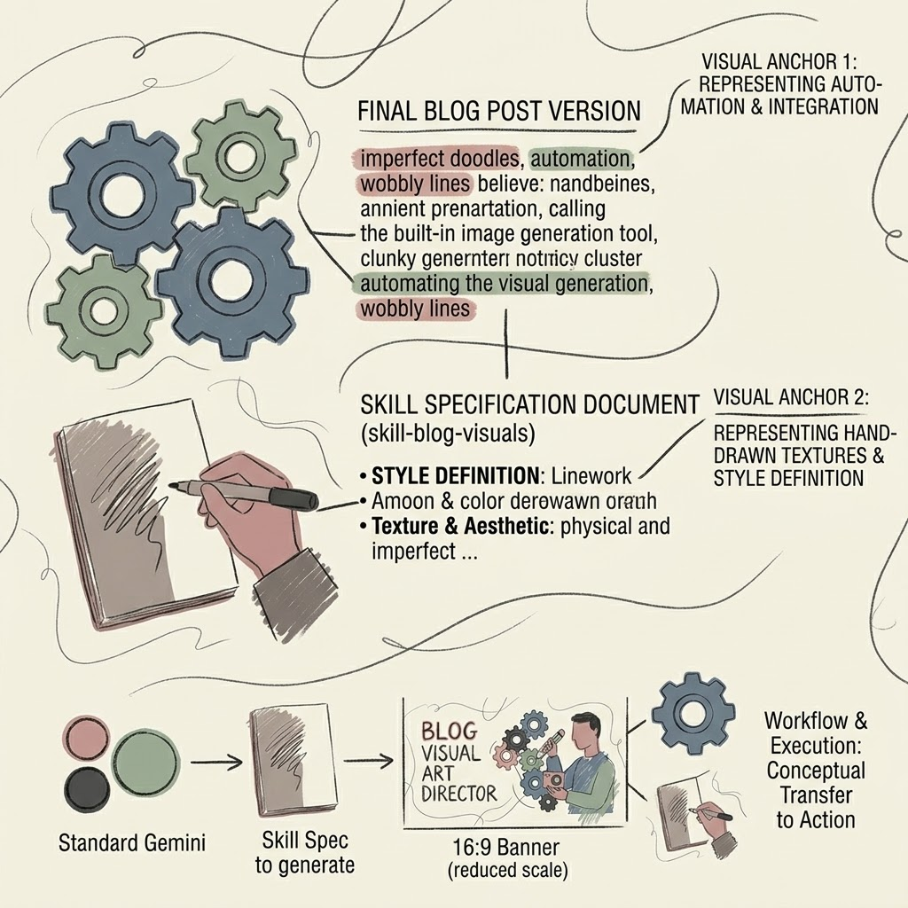

+++
date = '2026-08-26T15:22:34-04:00'
draft = false
title = 'blogging visual design'
tags = ['blog', 'banner', 'illustration']

[params.cover]
  image = "banner.jpeg"
  alt = "blogging visual design"
  relative = true
+++

I run a personal static blog built with Hugo, deploying through an automated GitHub Actions pipeline. The text publishing part is frictionless. Writing in Obsidian, pushing to the repository, and triggering the build is a solved problem. The visual part was the annoyance. Every time I needed a header image, I would ask an AI generator, and it always spat out a hyper-polished, mathematically perfect render. It looked like cheap stock photography.

I look at abstract art like Joan Miró and Cy Twombly often. What makes a doodle work is the physical traces. I wanted blog illustrations that looked like someone drew them quickly on scrap paper. I needed wobbly lines, colors bleeding outside the edges, and rough textures.

I engineered a specific set of rules to force the AI out of its default plastic aesthetic. The linework had to be wobbly, shaky, loose, and of slightly varied weight, mimicking a real felt-tip pen drawn in a single breath. For colors, I specified a "Lazy Offset" style where the color fill does not align with the line boundaries, recreating a misregistered screen-print error. The palette was restricted entirely to desaturated Morandi tones like dusty blue, sage green, cocoa brown, and aged creams, banning primary colors.

I initially tried packaging these rules into a dedicated Gemini Gem. That approach failed my friction test. Using a custom Gem means you have to start a completely new chat context. If I was already in a standard Gemini window brainstorming, drafting, or polishing a post, I would have to copy the final text, open the Gem, paste it, and run it. That breaks the flow. I wanted everything in one continuous conversation.

The solution was dropping the Gem and moving the logic to my Google Drive. I saved the entire design spec and generation prompt templates into a plain document named skill-blog-visual and dumped it in Drive.

Now, the workflow actually makes sense. I write and edit the blog post inside a standard Gemini chat. When the text is finalized, I do not switch windows. I just type a command in the same chat telling it to retrieve the skill-blog-visual document from Drive and generate the art. It seamlessly pulls the design constraints, reads the article from our immediate chat history, and calls the image generation tool on the spot.

It spits out a 16:9 banner with the title embedded into the negative space, plus a couple of 1:1 spot illustrations. I download the banner, drop it into my Obsidian vault inside the specific post's folder, and rename it to banner.jpg. The markdown links are simple. I hit one button to commit and push to GitHub. The GitHub Actions pipeline picks it up, Hugo rebuilds the site, and the post goes live with art that actually looks like human hands made it.
