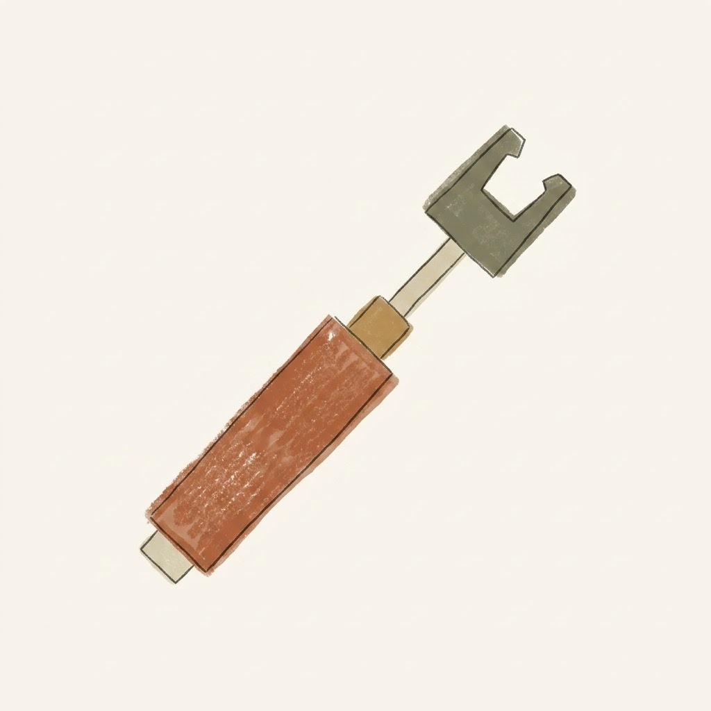

+++
date = '2026-08-26T12:06:43-04:00'
draft = false
title = 'Hardcore DIY Friday: AI and My Plumbing Repair'
tags = ['shower', 'plumbing', 'repair']

[params.cover]
  image = "banner.jpeg"
  alt = "Hardcore DIY Friday: AI and My Plumbing Repair"
  relative = true
+++

It happened on a Friday night, which is exactly when plumbing problems always decide to strike. The shower handle had been stiff for days, feeling like turning a rusty steering wheel. Then, right as I was trying to turn it off, something inside gave way. The water kept running. Not a drip, but a steady stream. A weekend emergency call to a plumber was going to cost a fortune. I pulled out my phone and opened Gemini, figuring I had nothing to lose by asking an artificial intelligence how to shut off a broken Moen shower. That kicked off a weekend of guided hardware debugging.

The entire repair process, from diagnosing the leak to tightening the final screw, was directed by Gemini from start to finish. I described the symptoms. It told me I was dealing with a failed Moen 1222 Posi-Temp cartridge inside the wall. The first step was getting the handle off, but the tiny hex set screw at the bottom of the heavy metal teardrop handle was completely stripped. A standard Allen key just spun uselessly. I took a photo of the stripped hole and uploaded it. Gemini suggested finding a slightly larger star shaped Torx bit and hammering it gently into the soft metal to get enough mechanical bite. I dug through my toolbox, found a T15 bit, forced it in, and the screw finally cracked loose.

Taking off the heavy chrome escutcheon plate was straightforward. That exposed the rough brass valve body set deep in the drywall. A small U shaped copper retaining clip held the pressurized system together. Gemini warned me to pull it straight up with needle nose pliers and set it far away from the drain. Dropping that piece behind the wall cavity means driving to the hardware store before you can turn the water back on.

With the clip gone, the cartridge was supposed to slide out. It did not budge. Calcification had cemented the plastic cartridge body to the inside of the brass pipe. I typed my frustration into the chat. The advice was clear: do not force it, do not pull on the brass stem with pliers, or the plastic sleeve will shatter inside the wall. Gemini told me to buy a dedicated cartridge puller. I found one at the local hardware store the next morning. It is a heavy steel tool that threads directly into the center brass stem of the old cartridge. You engage the two metal side tabs into the brass valve body, then slowly turn a massive hex nut clockwise with a large adjustable wrench. The mechanical advantage pushes against the pipe and pulls the stubborn cartridge straight out. When it popped free, the problem was obvious. The two large black oval rubber O-rings on the sides were shredded and unseated.

Moen provides a lifetime warranty on these parts. I drove to RONA with the ruined cartridge in a ziplock bag. I handed it to the person at the plumbing desk, and they handed me a brand new Moen 1222 cartridge in return. Free of charge.

Installing the new replacement requires specific steps. Gemini reminded me to lubricate the new rubber O-rings, otherwise they would simply tear again when forced into the tight brass pipe. I used a small silicone grease packet to coat the black oval seals thoroughly. I slipped the white plastic installation tool over the stem, using an adjustable wrench to push the cartridge flush into the wall while keeping it perfectly straight. The instruction from my AI guide was strict: make sure the "HC" marking on the front plastic face is pointing straight up at 12 o'clock.

I slipped the retaining clip back into its top slot, went down to the basement, turned the main water shutoff valve back on, and checked the brass fitting for leaks. It was completely dry.

There was one final hardware glitch. I put the black plastic adapter, the white limit stop gear, and the heavy metal handle back on. The hot and cold lines were reversed, and the handle pointed straight up when the water was off. Worse, when I turned it to the side, the heavy handle just fell down under its own weight. I went back to Gemini with a photo and a description of the symptoms.

The diagnosis came back immediately. If the "HC" is facing up but the water is reversed, I had accidentally rotated the brass stem 180 degrees during the installation. The fix is to pull the handle off, grip the bare brass stem with pliers, and rotate it exactly 180 degrees so the flat spot faces up again. As for the falling handle, Gemini explained it was a classic case of "Ghost Handle." The fresh factory silicone grease inside the new cartridge provides zero friction, so the heavy metal teardrop handle just falls under gravity. The advice was to do absolutely nothing. After a few days of regular showers, the hot water would melt away the excess grease and the friction would return to normal.

I rotated the brass stem. The handle pointed down for off, and turned left for cold and then hot water. The ghost handle issue resolved itself a few days later, exactly as predicted. It was a strange but satisfying weekend. I fixed a piece of physical household infrastructure using real tools, while a large language model sat on the bathroom counter walking me through every stripped screw and reversed valve. It felt like a very quiet, very perfect slice of daily life in the AI era.
