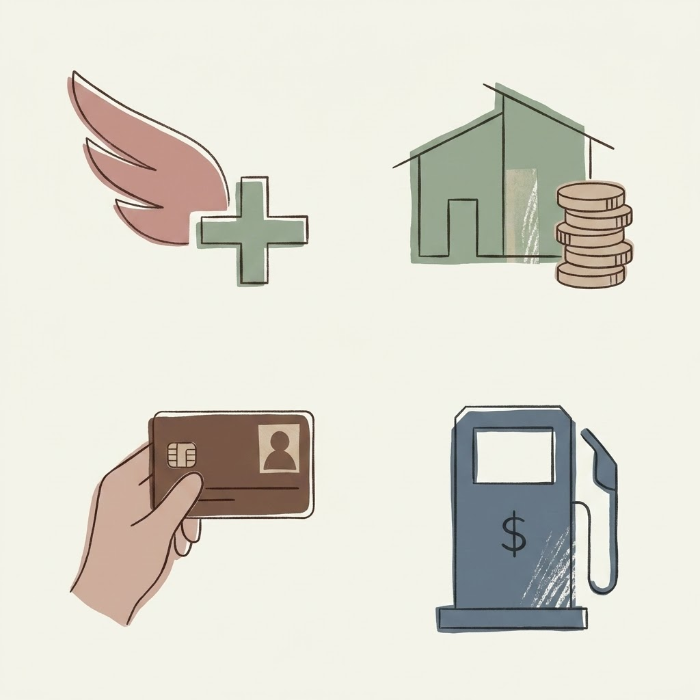

+++
date = '2026-09-04T14:11:17-04:00'
draft = false
title = 'My Wallet Setup: Optimizing Cash Flow with EQ Bank, Costco, and Aeroplan'
tags = ['EQ card', 'Costco', 'Aeroplan', 'spending', 'travel']

[params.cover]
  image = "banner.jpeg"
  alt = "wallet setup"
  relative = true
+++

I keep my daily living expenses in an EQ Bank account. Traditional banks like CIBC or TD pay essentially zero interest on checking balances, but EQ Bank gives me 2.75% on the money just sitting there. I have my direct deposits routed here. The cash sits and accumulates interest daily right up until the day my credit card bills are due. It is a simple mechanical setup to get some return on cash before it leaves my hands.

When it is time to buy groceries, the payment method splits depending on where I shop. For Costco runs, I take the CIBC Costco Mastercard. It earns 3% cash back at the gas station and 1% inside the warehouse. The physical card acts as my membership ID, so I just scan the back at the door and tap the front at the register.

For regular grocery stores, Costco does not code as a grocery category on the Visa network. Here, I switch to the CIBC Aeroplan Visa Infinite card. It earns 1.5 Aeroplan points per dollar spent on groceries and gas. Splitting the spending this way ensures I get the correct return for the specific category.

Booking travel requires a different focus. The Aeroplan Visa Infinite is the tool for this. I put flights and car rentals on it. Booking Air Canada tickets gets 1.5 points per dollar and a free first checked bag. Charging the full cost to the Visa activates the built-in travel insurance. When I rent a car, the card covers collision and loss damage. I decline the daily coverage at the rental counter. The card also handles emergency medical and trip delay coverage out of province.

Traveling outside Canada breaks the domestic card strategy. The CIBC Costco and Aeroplan Visa cards both charge a 2.5% foreign exchange fee on non-Canadian purchases. I avoid this entirely by using the physical EQ Bank Card. It is a prepaid Mastercard linked directly to the high-interest account. Whether I am driving down to Albany and stopping for coffee, or paying for a ticket in Europe, the EQ card uses the exact Mastercard exchange rate. There is a 0% FX markup. I only use the Visa abroad when a true credit card is structurally required, like leaving a security deposit at a hotel check-in desk.

