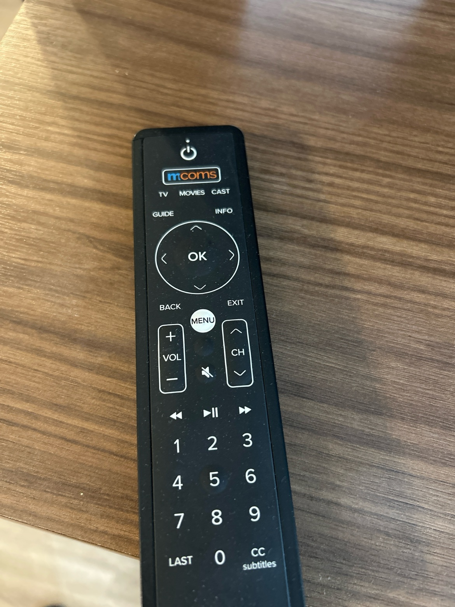
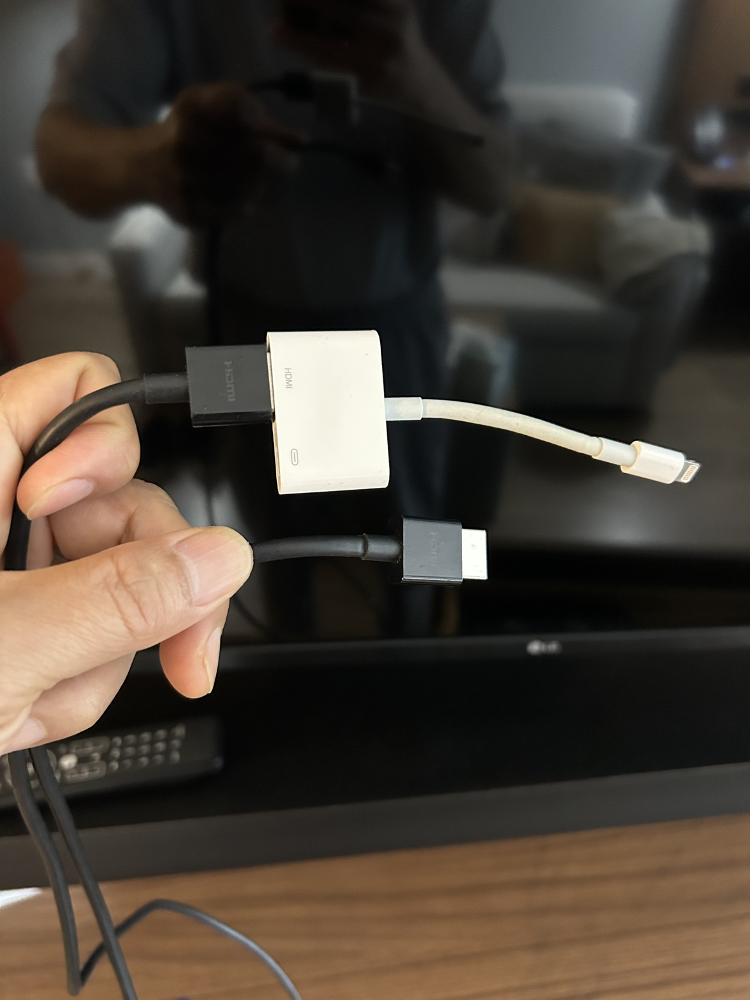

+++
date = '2026-10-04T16:16:29-04:00'
draft = false
title = 'Bypassing Locked Hotel TVs to Mirror Your iPhone'
tags = ['hotels', 'travel', 'iphone', 'hdmi']

[params.cover]
  image = "banner.jpg"
  alt = "Bypassing Locked Hotel TVs to Mirror Your iPhone"
  relative = true
+++

You drop your suitcase on the carpet. The room smells faintly of industrial cleaner and stale air conditioning. You have been traveling all day. The last thing you want to do is navigate channel after channel of local news and infomercials. You want to watch the shows you saved on your phone.

You planned ahead. You brought a Lightning Digital AV Adapter. You run an HDMI cable from the adapter to the back of the hotel TV. You plug the Lightning end into your phone. Then you pick up the remote.

It is a heavy black plastic wand with the mcoms logo printed near the top. You scan the buttons. Power, volume, channel up and down. A white MENU button in the dead center. There is no input button. There is no source button. The hotel has completely locked you out of changing the HDMI channel.

They do this intentionally. Hospitality systems are designed to keep you inside their interface, renting their movies, or at least looking at their promotional splash screens. Getting your own screen up there requires breaking out of the sandbox.

## Get the hardware right

First, you have to get the hardware right. The genuine Apple Lightning to HDMI adapter works without external power. Plug a charger into the second Lightning port on the white adapter block anyway. A long movie will drain the phone fast, and keeping it topped up costs you nothing. Some third-party adapters are different. They need that port powered before they will show a picture at all, so if your screen stays dark, power is the first thing to check. The port is worth using either way.

That adapter holds more than a connector. Inside the white block there is a small ARM processor with 256 MB of its own memory. Lightning cannot send a raw HDMI signal, so the phone sends an H.264 video stream and the processor in the adapter decodes it and puts it out over HDMI. That is why the adapter costs what it does, and why cheap copies behave so unevenly.

## Start with the hotel menu

Now you have to get the TV to look at your cable. Start with the easiest path. Press that white MENU button on the mcoms remote. This pulls up the hotel dashboard. Use the directional arrows to scroll through the tiles. You are looking for a section called Guest Device. Click into it. Then find Connection. Selecting this tells the hotel software to open up the auxiliary HDMI ports for your device. Your iPhone screen should pop up.

## Try casting before you move the TV

Try the wireless route next, before you start moving the TV around. Some newer mcoms installations support Apple AirPlay directly. Check the remote again. If you see a CAST button next to the MOVIES button, press it. The screen will generate a unique QR code. Open your iPhone camera, scan the code, and your phone will join the network for that room and connect to that TV. The pairing is tied to the room and resets when you check out, so the next guest starts clean.

Wireless casting on shared hotel Wi-Fi can still be miserable. The video drops. The audio drifts out of sync. If the picture will not hold up, go back to the cable and keep working through the steps below. The hardwired adapter is the reliable method. Keep the phone plugged in, set display auto lock to Never for the evening, and the screen will stay awake as long as you need it to. Remember to turn auto lock back on when you pack up.

## Use the controls on the TV itself

Sometimes the menu is stripped down and the Guest Device option is missing. You have to bypass the software entirely. Walk up to the TV and look for the physical control on the set itself. Many LG sets hide a small joystick under the bottom edge, near the logo. Others put a single button on the side or around the back. The location changes from model to model, so feel along the edges rather than trusting one spot. Press the control to bring up the TV menu, nudge it sideways to reach the Input menu, press again, and select the HDMI port you used. That menu belongs to the TV, and it sits underneath the hotel layer.

## Borrow the port the hotel box uses

Occasionally that physical control does nothing. Hotel mode can disable the buttons on the set along with the buttons missing from the remote. If that happens, look behind the TV panel. You will often find a small black box fixed to the back of the TV or hidden behind it. This is the box that feeds the hotel system into the TV. Follow the HDMI cable running out of that box and into the TV. It is commonly plugged into HDMI 1.

Use that port. Unplug the hotel cable from the TV and plug your own HDMI cable into the same port. You do not need to change the input, because the TV is already set to the input the hotel box uses. The screen will show your phone in place of the hotel welcome page. Go gently if the TV is wall mounted, and do not force a panel that will not move. When you check out, plug their cable back into the same port so the room is left the way you found it.

## When the streaming apps go black

Once you get the picture on the screen, you might run into the black screen problem. You open your photo gallery and it works. You open Safari and you can read websites on the big screen. Then you open Netflix or Prime Video, hit play, and the TV goes black while the audio keeps playing. This is a digital rights problem. Some third-party adapters handle HDCP, the copy protection used by streaming services, badly or not at all, and the app kills the video feed when the check fails. A few apps also block external displays no matter which adapter you use. For paid streaming, the genuine Apple adapter is the reliable choice. It handles the protection checks the way the apps expect.

## If your phone has USB-C

If you recently upgraded your phone, you also have to update your travel bag. The Lightning adapter only works on older devices. If you have an iPhone 15 or newer with a USB-C port, do not try to daisy chain a small USB-C to Lightning adapter onto your old video block. Those tiny tips pass charging and basic data. They do not carry video. Leave the Lightning adapter at home and bring a dedicated USB-C to HDMI cable or hub instead. The newer phone makes this part simpler, as long as you pack the right cable.

