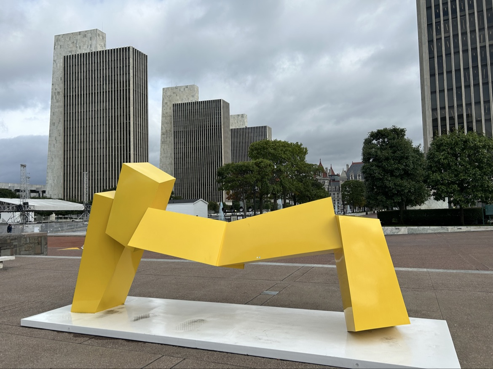
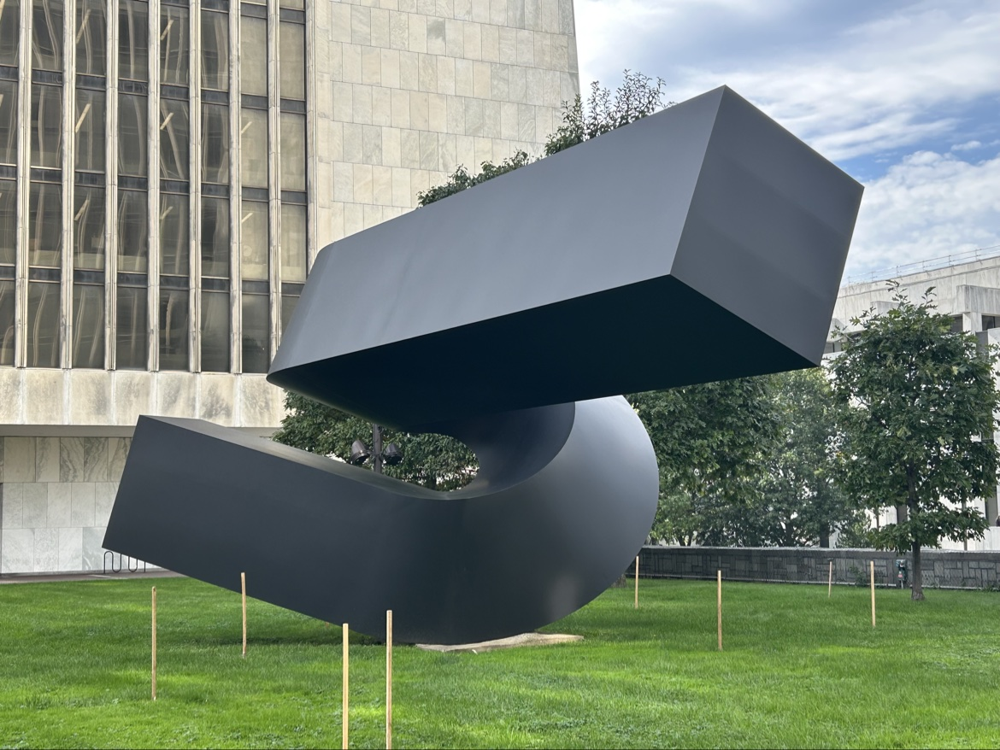
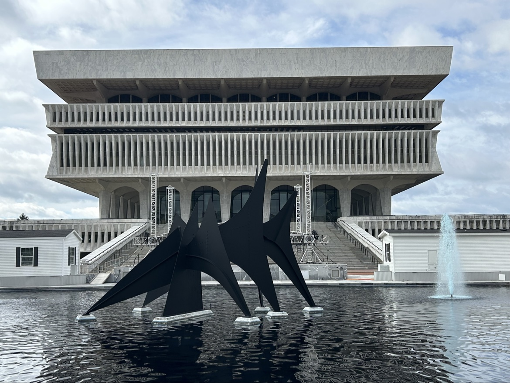

+++
date = '2026-10-04T13:30:21-04:00'
draft = false
title = 'Concrete, Canvas, and a $10 Stroke of Luck: An Art Pilgrimage to the Empire State Plaza'
tags = ['albany', 'empire-state-plaza', 'art', 'road-trip', 'new-york']

[params.cover]
  image = "banner.jpg"
  alt = "Concrete, Canvas, and a $10 Stroke of Luck: An Art Pilgrimage to the Empire State Plaza"
  relative = true
+++

## The last stall in the garage

There is a distinct kind of travel adrenaline that only occurs underground, under buzzing sodium vapor lights, inside a subterranean parking labyrinth beneath thousands of tons of poured concrete.

We reached Albany on Tuesday, September 29, on the drive home from Philadelphia to Montreal, and stayed the night. The city earns that stop. Albany sits about 220 miles from Montreal and about 230 miles from Philadelphia, almost exactly halfway on the drive, an easy evening run from either end. The next morning, Wednesday, September 30, we went to the Empire State Plaza and arrived just around 10:00. The digital signs outside the visitor garage flashed the one word every road tripper dreads: FULL. The lanes were lined with brake lights and polite desperation. Then a pair of reverse lights flickered white in the gloom of the lower level, a sedan pulled out, and we slipped into the last open stall we could find in the complex.

Four hours of world class art and heavy architecture for a flat $10 fee felt like getting away with something. The visitor lot under the Plaza, the V-Lot, charges a $10 flat fee on weekdays, and it takes cards only. No cash changed hands.

Taking the elevator up from the garage feels like moving between two different centuries. You come out first into the Concourse, then push out onto the windswept, open expanse of the Plaza deck, and the scale of the place lands all at once.

## The Plaza deck

The Plaza was designed by Wallace Harrison and his firm, Harrison and Abramovitz, under Governor Nelson Rockefeller. Construction started in 1965, and the complex was finished in 1976. People still argue over the style label. Modernist, brutalist, and international all get used. Standing on the deck, the label feels secondary. Four matching agency towers, each 23 stories, stand in a line on the west side of a row of reflecting pools. The 44 story Corning Tower stands on the east side, and near it sits The Egg, a smooth oval performing arts building set on a narrow base.

What keeps the deck from feeling like a cold bureaucratic citadel is the outdoor sculpture, and the colour starts small. Near the foot of Agency Building 3 stands Ellsworth Kelly's Yellow Blue from 1968, a painted steel wall 9 feet high and nearly 16 feet across, yellow on one face and blue on the other. It is modest next to the towers, and that is the point of it. One flat field of colour, then another, with nothing else to look at.

At the south end of the Plaza, in front of Agency Building 1, George Sugarman's Trio fills a much bigger footprint. It is painted aluminum, bright yellow, 10 feet tall and 32 feet long, a series of curves and angles that keeps changing as you walk around it. The state took it away for conservation and put it back in this spot in 2023. Against the grey stone of the towers behind it, the yellow is hard to miss.

*George Sugarman, Trio (1969-71), painted aluminum, at the south end of the Plaza in front of Agency Building 1.*

On the grass on the west side of the Plaza sits the outdoor piece I liked most, Clement Meadmore's Verge. It stretches 36 feet across, a single thick form in painted Cor-Ten steel, twisted into a slow curve that lifts one end high into the air. At more than 20,000 pounds it is the largest single sculpture in the collection, and it still looks light, balanced on one small patch of concrete.

*Clement Meadmore, Verge (1971-72), painted Cor-Ten steel, on the west side of the Plaza.*

Tony Smith's The Snake Is Out works in a different way. It is painted mild steel, black and angular, a zigzag of massive forms with a triangular opening through the middle. From one side it reads as a solid block. Two steps later the opening lines up, and you can see straight through it.

George Rickey's Two Lines Oblique moves. Two stainless steel lines, each 32 feet long, turn slowly on a Y shaped stand on the west Plaza, swinging in wide circles that carry them from about 8 feet off the ground to 54 feet in the air. On a windy day the whole deck feels measured by them.

At the southern end, in the reflecting pool in front of the State Museum, Alexander Calder's Triangles and Arches rises out of the water on seven piers. The black painted steel is all points and triangles, 19 feet high and 30 feet across, and on a calm morning the reflection doubles it. Behind it, the museum sits up on its wide flight of steps.

*Alexander Calder, Triangles and Arches (1965), painted steel, in the reflecting pool in front of the New York State Museum.*

## The Concourse

When the wind picks up on the deck, the move is to head down into the Concourse, a quarter mile corridor of marble and terrazzo that runs under the Plaza and connects the buildings. To a state worker crossing it with an iced coffee, it is a route between the Capitol and the cafeterias. To anyone who likes art, it is also a gallery, one that happens to have offices and services opening off it.

Rockefeller had a commission choose the work while the Plaza was being built, and the walls hold a dense run of New York School painting. You turn a corner, past a dry cleaner, and stand in front of Mark Rothko's Untitled from 1967, a big canvas that fills your field of vision when you step close. A short walk away is Helen Frankenthaler's Capri from 1967, painted in acrylic, with colour spread across the canvas in wide washes. Jackson Pollock is here with Number 12, 1952, dense and restless at close range. Franz Kline's Charcoal Black and Tan from 1959 does what its title says, heavy black strokes laid over a tan ground.

Two of the works I had expected to find in the Concourse actually sit over in the Corning Tower, at Plaza level. Donald Judd's Untitled from 1968 is a stack of ten matching boxes in stainless steel and amber Plexiglas, fixed to the wall in a straight vertical line. In the Plaza lobby of the same tower, Louise Nevelson's Atmosphere and Environment V is a wall of 24 black boxes in enamelled aluminum, each box holding its own small construction of shapes. At a distance it looks like her famous wood assemblages. Up close the material is metal, and the forms inside are precise rather than salvaged.

Isamu Noguchi's Studies for the Sun stayed with me for a different reason. He worked on the same idea three times between 1959 and 1964, and the collection holds versions in travertine, iron, and bronze. Same idea, three weights, three surfaces.

There are no ticket desks down here and no timed entry. The art shares the corridor with people going to work, which is the best part of the collection. High modernism ended up as civic infrastructure, and it still gets used that way every weekday.

## The State Museum

At the southern end of the Plaza axis sits the Cultural Education Center, the big stepped building that houses the New York State Museum, the State Library, and the State Archives. Admission to the museum is free. Climbing the steps in front of it gives the clearest view in Albany. You look north over the Calder in its pool, along the reflecting pools, past the agency towers, to the State Capitol, a 19th century building that looks like a French chateau dropped into a modernist plan.

Inside, the museum changes the subject, away from abstract form and toward objects with lives attached. The Cohoes Mastodon was found in 1866, during construction of Harmony Mill No. 3 near Cohoes Falls on the Mohawk River, and its skeleton has been one of the museum's treasures ever since. From there the galleries move through Adirondack logging camps and Iroquois longhouses, set out as full size scenes you can walk past slowly.

The gallery that stayed with me longest is The World Trade Center: Rescue, Recovery, Response. Near its centre is Engine 6, a fire pumper that was heavily damaged on September 11, set out with a large steel column from the towers and objects recovered during the cleanup at Fresh Kills. Nothing in the room is presented dramatically. The objects do the work on their own.

Walking back to the garage later that afternoon, down into the quiet under the Plaza, the $10 parking charge felt well spent. Albany's Plaza gets criticized for its scale and its monumentality, and some of that criticism is fair. The art is the counterweight. We had parked under a government complex, ridden an elevator up, and spent four hours with work by Pollock, Rothko, Calder, and a long list of their contemporaries, in a city we had picked mainly because it split the drive home in half. The art and the museum had cost us nothing. Parking was the whole bill.

